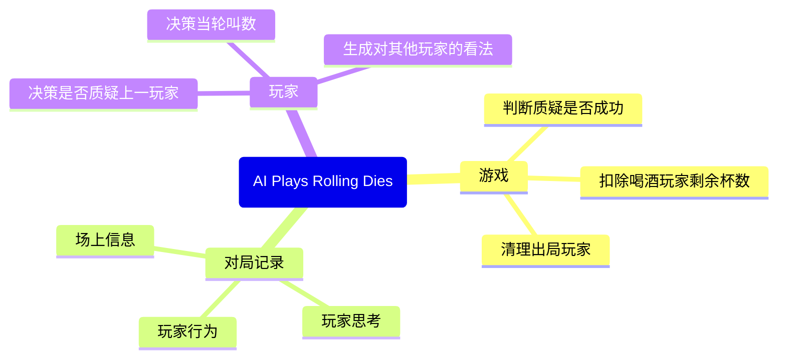

# AI Plays Rolling Dies
本项目是一个由LLM驱动的摇色子模拟程序。

本项目受[LYiHub](https://github.com/LYiHub/)的[Liars Bar LLM](https://github.com/LYiHub/liars-bar-llm)项目启发。在此向[LYiHub](https://github.com/LYiHub/)鸣谢。

---

